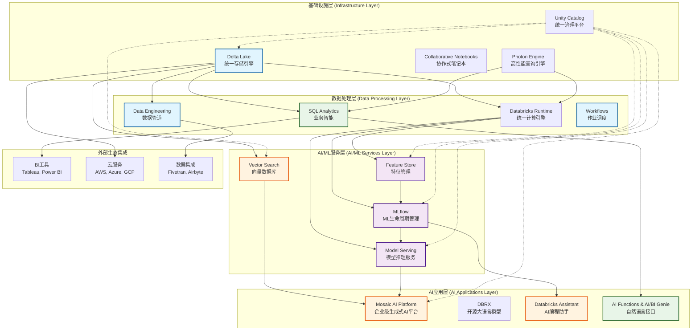

# Databricks产品模块架构关系图

## 完整架构图



## 架构层次详细说明

### 1. 基础设施层 (Infrastructure Layer)
- **Delta Lake**: 统一存储引擎，提供ACID事务和版本控制
- **Unity Catalog**: 跨云统一治理平台，管理所有数据和AI资产
- **Photon Engine**: C++向量化查询引擎，提供3-5倍性能提升
- **Collaborative Notebooks**: 多语言协作开发环境

### 2. 数据处理层 (Data Processing Layer)
- **Databricks Runtime**: 优化的Apache Spark运行时
- **SQL Analytics**: 高性能SQL查询和可视化
- **Data Engineering**: ETL/ELT数据管道处理
- **Workflows**: 作业调度和编排系统

### 3. AI/ML服务层 (AI/ML Services Layer)
- **MLflow**: 开源ML生命周期管理平台
- **Feature Store**: 特征工程和管理服务
- **Model Serving**: 实时和批量模型推理
- **Vector Search**: 高性能向量存储和搜索

### 4. AI应用层 (AI Applications Layer)
- **Mosaic AI Platform**: 企业级端到端生成式AI平台
- **DBRX**: 专为企业优化的开源大语言模型
- **Databricks Assistant**: 基于代码理解的AI编程助手
- **AI Functions & AI/BI Genie**: 自然语言数据查询接口

## 用户群体与产品模块对应关系

| 用户群体 | 主要使用模块 | 颜色标识 |
|---------|-------------|----------|
| **数据工程师** | Data Engineering, Delta Lake, Workflows | 蓝色 |
| **数据科学家** | MLflow, Feature Store, Model Serving | 紫色 |
| **业务分析师** | SQL Analytics, AI/BI Genie | 绿色 |
| **AI开发者** | Mosaic AI, Vector Search, Databricks Assistant | 橙色 |

## 核心关系特征

### 数据流向关系
```
原始数据 → Delta Lake → 数据处理 → 特征工程 → 模型训练 → 模型服务 → AI应用
```

### 治理覆盖关系
Unity Catalog横向管理所有层级的数据和AI资产，提供统一的：
- 权限控制和访问管理
- 数据血缘追踪
- 合规性和审计
- 资产发现和分类

### 计算支撑关系
Photon Engine + Databricks Runtime为所有计算工作负载提供底层优化：
- SQL查询加速
- ML训练优化
- 流处理性能提升
- 自动资源管理

## Lakehouse架构的统一性

所有产品模块基于**Lakehouse架构**实现：

1. **统一存储**: 所有数据类型统一存储在Delta Lake
2. **统一计算**: 同一引擎支持多种工作负载
3. **统一治理**: Unity Catalog提供端到端治理
4. **统一开发**: 协作式环境支持全栈开发

这种架构设计消除了传统数据孤岛问题，让企业能够在一个平台上完成从数据处理到AI应用的全流程开发，大大提高了数据利用效率和开发效率。